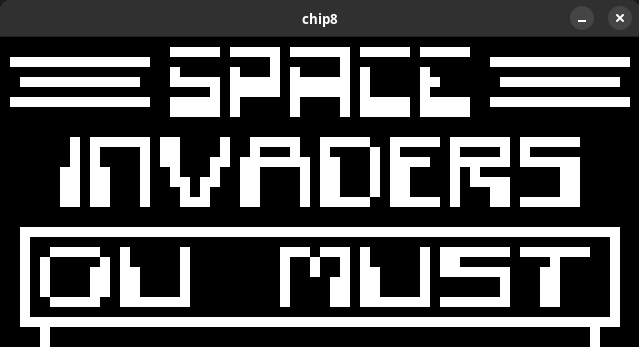

# Chip 8 Emulator




A chip8 emulator written in rust.

## Usage

```
Usage: chip8 [OPTIONS] <PATH>

Arguments:
  <PATH>  Path of the chip8 executable

Options:
  -s, --speed <SPEED>              Speed of the emulator , how many cycles runs per frame [default: 20]
  -S, --screen-size <SCREEN_SIZE>  Window dimensions, multiplied by 32*64 [default: 10]
  -f, --framerate <FRAMERATE>      Framerate [default: 240]
  -h, --help                       Print help
  -V, --version                    Print version
```

## Used resources

  [Cowgod's Technical Reference](http://devernay.free.fr/hacks/chip8/C8TECH10.HTM)  
  [tobiasvl's Blog Post](https://tobiasvl.github.io/blog/write-a-chip-8-emulator/)  
  [corax89's Test rom](https://github.com/corax89/chip8-test-rom)  
